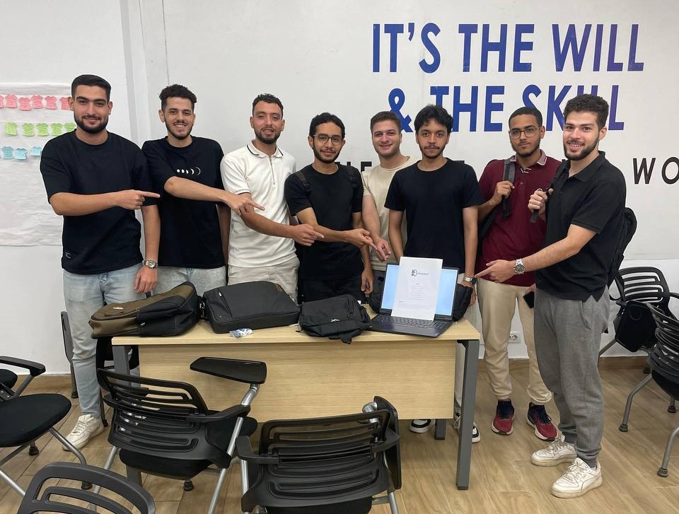

# MindShelf 📚

**A Comprehensive Digital Library and Book Marketplace Platform**

[](https://dotnet.microsoft.com/)
[](https://docs.microsoft.com/en-us/aspnet/core/)
[](https://docs.microsoft.com/en-us/ef/)
[](https://stripe.com/)
[](https://developers.google.com/identity)

---

## 🎯 Project Overview

MindShelf is a comprehensive digital library and book marketplace platform designed to revolutionize how people discover, purchase, and engage with books. Built as part of the ITI (Information Technology Institute) hackathon, MindShelf combines e-commerce functionality with community features to create an immersive reading experience.

### 🏆 Hackathon Context
This project was developed for the **ITI .NET Training Hackathon**, showcasing advanced .NET technologies, modern web development practices, and innovative business solutions in the digital publishing space.

---

## ✨ Key Features

### 📖 **Book Management System**
- **Comprehensive Book Catalog**: Browse thousands of books with detailed information
- **Advanced Search & Filtering**: Find books by title, author, category, price range, and ratings
- **Book Details**: Rich book information including descriptions, reviews, ratings, and availability
- **Stock Management**: Real-time inventory tracking and management

### 👥 **User Management & Authentication**
- **Secure Registration/Login**: Traditional email/password authentication
- **Google OAuth Integration**: One-click login with Google accounts
- **User Profiles**: Comprehensive user profiles with personal information
- **Role-Based Access**: Different access levels for users and administrators

### 🛒 **E-Commerce Features**
- **Shopping Cart**: Add/remove books, update quantities, save for later
- **Order Management**: Complete order lifecycle from placement to delivery
- **Payment Integration**: Secure payments via Stripe
- **Order Tracking**: Real-time order status updates
- **Order History**: Complete purchase history for users

### ⭐ **Review & Rating System**
- **User Reviews**: Detailed book reviews from verified purchasers
- **Rating System**: 5-star rating system with average calculations
- **Review Management**: Users can edit/delete their reviews
- **Review Analytics**: Track review counts and average ratings per book

### 📅 **Event Management**
- **Book Events**: Create and manage book-related events
- **Event Registration**: Users can register for events
- **Online/Offline Events**: Support for both virtual and physical events
- **Event Calendar**: View upcoming events and schedules

### ❤️ **Personalization Features**
- **Favorites**: Save favorite books for quick access
- **Recommendations**: Personalized book suggestions based on user preferences
- **Reading Lists**: Create custom reading lists
- **User Dashboard**: Personalized dashboard with reading statistics

### 🏷️ **Category & Author Management**
- **Book Categories**: Organized book categorization system
- **Author Profiles**: Detailed author information and biography
- **Popular Authors**: Featured authors based on popularity metrics
- **Category Browsing**: Easy navigation through book categories

---

## 🏗️ Technical Architecture

### **Technology Stack**
- **Backend**: ASP.NET Core 8.0 MVC
- **Database**: SQL Server with Entity Framework Core
- **Authentication**: ASP.NET Core Identity + Google OAuth
- **Payment Processing**: Stripe API
- **Frontend**: Razor Views with Bootstrap
- **Deployment**: Docker + Render.com

### **Architecture Pattern**
- **Clean Architecture**: Separation of concerns with distinct layers
- **Repository Pattern**: Data access abstraction
- **Unit of Work**: Transaction management
- **Dependency Injection**: Loose coupling and testability

### **Project Structure**
```
MindShelf/
├── MindShelf_PL/           # Presentation Layer
│   ├── Controllers/        # MVC Controllers
│   ├── Views/             # Razor Views
│   └── wwwroot/           # Static files
├── MindShelf_BL/          # Business Logic Layer
│   ├── Services/          # Business services
│   ├── Dtos/             # Data Transfer Objects
│   └── Interfaces/       # Service contracts
└── MindShelf_DAL/         # Data Access Layer
    ├── Models/           # Entity models
    ├── Data/            # DbContext
    └── Migrations/       # Database migrations
```

---

## 💼 Business Model & Value Proposition

### **Target Market**
- **Primary**: Book enthusiasts, students, and professionals
- **Secondary**: Educational institutions and libraries
- **Tertiary**: Authors and publishers seeking digital distribution

### **Revenue Streams**
1. **Book Sales Commission**: Percentage-based commission on book sales
2. **Premium Subscriptions**: Advanced features for power users
3. **Event Hosting**: Fees for premium event hosting services
4. **Author Services**: Tools and services for authors and publishers
5. **Advertising**: Sponsored book recommendations and banner ads

### **Competitive Advantages**
- **Community Integration**: Events and social features beyond simple e-commerce
- **Comprehensive Reviews**: Detailed review system with verified purchasers
- **Personalization**: AI-driven recommendations and reading lists
- **Multi-format Support**: Digital and physical book options
- **Educational Focus**: Special features for students and educators

### **Market Opportunity**
- **Growing E-book Market**: $15.3 billion market growing at 12.5% annually
- **Digital Transformation**: Accelerated shift to online book purchasing
- **Educational Technology**: Increased demand for digital learning resources
- **Community Engagement**: Rising interest in book clubs and reading communities

---

## 🚀 Getting Started

### **Prerequisites**
- .NET 8.0 SDK
- SQL Server (LocalDB or full instance)
- Visual Studio 2022 or VS Code
- Stripe account (for payments)
- Google Cloud Console project (for OAuth)

### **Installation**
1. **Clone the repository**
   ```bash
   git clone https://github.com/your-team/mindshelf.git
   cd mindshelf
   ```

2. **Configure Database**
   - Update connection string in `appsettings.json`
   - Run migrations: `dotnet ef database update`

3. **Set up Environment Variables**
   ```bash
   # Create .env file
   STRIPE_SECRET_KEY=your_stripe_secret_key
   STRIPE_PUBLISHABLE_KEY=your_stripe_publishable_key
   GOOGLE_CLIENT_ID=your_google_client_id
   GOOGLE_CLIENT_SECRET=your_google_client_secret
   ```

4. **Run the Application**
   ```bash
   dotnet run --project MindShelf_PL/MindShelf_PL
   ```

### **Deployment**
- **Production**: Deployed on Render.com with PostgreSQL
- **Docker**: Containerized for easy deployment
- **CI/CD**: Automated deployment pipeline

---

## 📊 Key Metrics & KPIs

### **User Engagement**
- Monthly Active Users (MAU)
- Average Session Duration
- Books Added to Cart per Session
- Review Submission Rate

### **Business Metrics**
- Conversion Rate (Visitors to Purchasers)
- Average Order Value (AOV)
- Customer Lifetime Value (CLV)
- Revenue per User

### **Technical Performance**
- Page Load Times
- API Response Times
- Database Query Performance
- System Uptime

---

## 🤝 About Our Team

### **Team Introduction**
We are a passionate team of .NET developers from the Information Technology Institute (ITI), united by our love for technology and innovation. Our diverse backgrounds in software development, database design, and user experience have come together to create MindShelf.

### **Team Members**

<div align="center">

#### **Mohamed Khaled Elzalook** - Database Specialist & Lead Developer


- **Role**: Database design, data modeling, and system development
- **Expertise**: SQL Server, Entity Framework, Database Architecture, ASP.NET Core
- **Contribution**: Designed database schema, implemented data models, and optimized database performance

#### **Hossam Ahmed** - Frontend Developer & Integrations


- **Role**: User interface design, frontend development
- **Expertise**: Third-party integrations, Bootstrap, responsive design
- **Contribution**: Created intuitive user interfaces and enhanced user experience, Integrated Payment system

#### **Zeyad Yasser** - Lead Backend Developer & Architect


- **Role**: Backend services, Layered Architecture design, API development
- **Expertise**: Backend, Entity Framework, RESTful APIs
- **Contribution**: Implemented robust Backend and optimized website performance

#### **Tamem Abdrabou** - Backend Engineer


- **Role**: Backend services, DTOs, Controllers, and Views
- **Expertise**: ASP.NET Core, Entity Framework, MVC Controllers
- **Contribution**: Developed services, DTOs, controllers and their corresponding views

#### **Hossam Fathy** - Backend Engineer


- **Role**: Authentication, Authorization, and Order Management
- **Expertise**: ASP.NET Core Identity, Authorization, Order Processing
- **Contribution**: Implemented authentication and authorization with Identity framework and order management across all layers

#### **Osama Ayman** - Backend Engineer


- **Role**: Favourite Book Service Development
- **Expertise**: ASP.NET Core, Entity Framework, Service Layer
- **Contribution**: Developed favourite book service, controllers, DTOs and views

#### **Islam Elshahawi** - Integration Specialist & DevOps Engineer


- **Role**: Third-party integrations, deployment, DevOps
- **Expertise**: GitHub Actions, Docker, Render deployment
- **Contribution**: Integrated payment systems and managed deployment pipeline

#### **Mohamed Marey** - Quality Assurance & Testing Engineer


- **Role**: Testing, quality assurance, documentation
- **Expertise**: Unit testing, integration testing, user acceptance testing
- **Contribution**: Ensured code quality and comprehensive testing coverage

</div>

### **Team Photo**
<div align="center">

</div>

### **Our Mission**
To democratize access to knowledge and create meaningful connections between readers, authors, and the broader literary community through innovative technology solutions.

### **Our Values**
- **Innovation**: Constantly pushing the boundaries of what's possible
- **Quality**: Delivering robust, scalable, and maintainable solutions
- **Community**: Building platforms that bring people together
- **Learning**: Continuous growth and knowledge sharing
- **Excellence**: Striving for the highest standards in everything we do

---

## 🙏 Acknowledgments

- **ITI (Information Technology Institute)** for providing the platform and resources
- **Microsoft** for the comprehensive .NET ecosystem
- **Stripe** for seamless payment processing
- **Google** for authentication services
- **Render** for reliable cloud hosting
- **Our mentors and instructors** for their guidance and support

---

## 📚 Additional Documentation

For comprehensive documentation, please refer to our complete documentation suite:

- **[Documentation Index](DOCUMENTATION_INDEX.md)** - Complete guide to all documentation
- **[Project Presentation](PROJECT_PRESENTATION.md)** - Executive presentation for hackathon judges
- **[Technical Architecture](TECHNICAL_ARCHITECTURE.md)** - Detailed technical implementation guide
- **[API Documentation](API_DOCUMENTATION.md)** - Complete API reference and examples
- **[User Guide](USER_GUIDE.md)** - Comprehensive user manual and help
- **[Deployment Guide](DEPLOYMENT.md)** - Production deployment instructions

---

*Last updated: January 2025*
